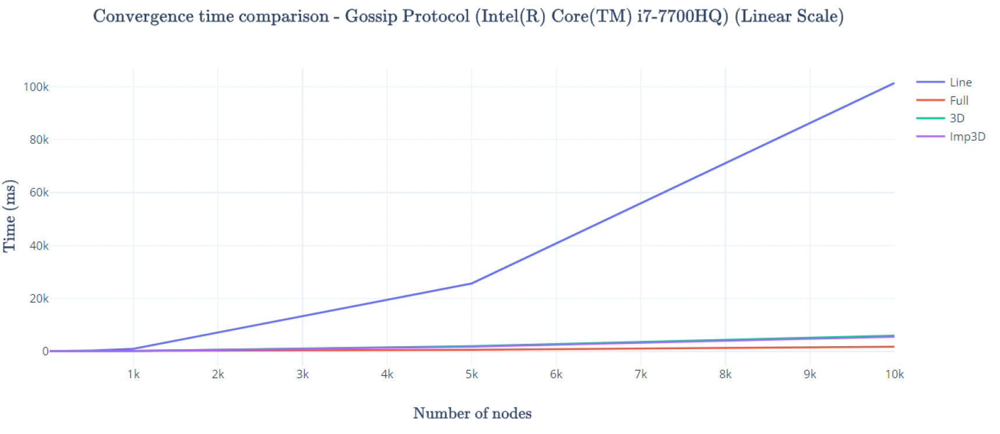
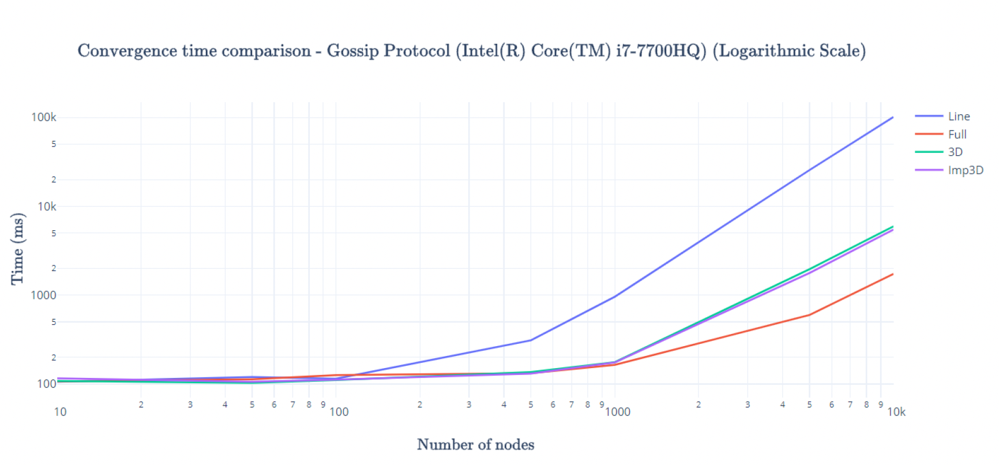
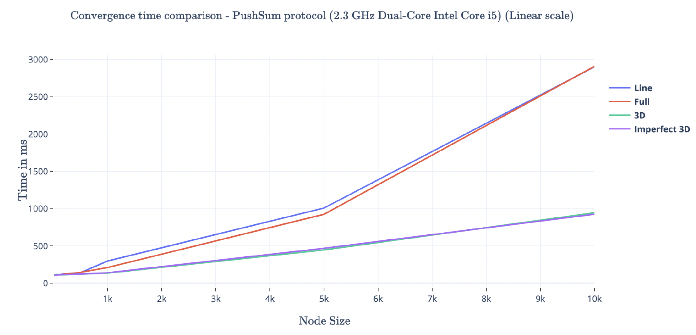
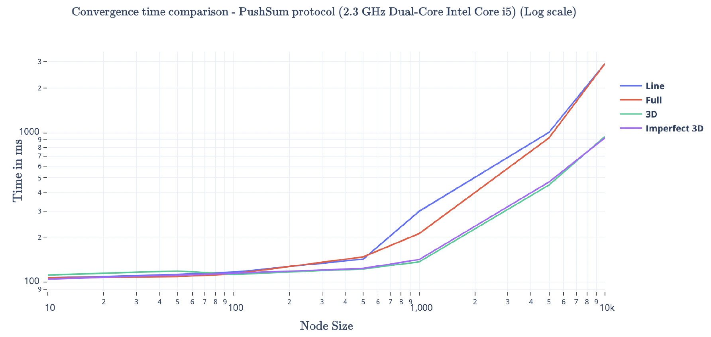

# Gossip-PushSum-Protocols
Simulating gossip and push sum using Akka Actor Model.

#### How to run:
* To run the script file, open a terminal and type the following command:
> dotnet fsi project2.fsx `<number of nodes>` `<topology>` `<algorithm>`

#### What is working?
* For both gossip and push sum all nodes are getting converged for all topologies:
    * Line
    * Full
    * 3D
    * Imperfect 3D. 
  
#### Convergence Criteria:
  * **Gossip Protocol**:\
  In gossip protocol each node sends the received message to one of its neighbours selected at random.
  A node upon receiving the message transmits the message to its neighbours till the node converges. If the node receives the message 10 times,
  then it is said to have converged. The entire system is said to have converged if all the nodes in the network have converged successfully.
  
  * **Push-Sum Protocol**:\
  In Push-Sum protocol, each node is initiated with the values of sum and weight. Sum is initiated with a
  value as the sum of its index (in a 3D grid) or its index in the list. The value of weight for each node 
  is initiated to 1. A node is randomly selected by the supervisor and it sends the message to the worker node to
  start the algorithm. Each node, while sending a message to its neighbours, keeps half the value of sum and weight and
  sends the remaining half. Upon receiving the message, each node adds the received sum and weight pair to its own value
  and the ratio (sum/weight) is calculated. If the change in ratio is less than 10-10 for 3 consecutive rounds then the 
  node is said to have converged. The network is said to have converged if all the nodes have converged.

#### Time for convergence:
* **Gossip Protocol**:\
  The comparison for time taken for the network to converge is given in the following graph.
  
  
  
* Observations:
  * The convergence time for Full network is the least among all. This is due to the fact that each node has every other
  node as its neighbour. So, the number of nodes through which it can receive a message is the highest.
  * The highest time is taken by the Line network. As each node has only 2 neighbours irrespective of the size of the network,
  it takes a very long time for each node to converge.
  * In an imperfect 3D network, each node has 1 extra randomly selected neighbour compared to the 3D network. 
  The advantage of this is demonstrated in the imperfect 3D network having slightly lower convergence time than 3D networks.
  * For a very small number of nodes, Line network has slightly lower convergence time than others.
  
* **Push-Sum Protocol**:
  The comparison for time taken for the network to converge is given in the following graph.
  
  
  
* Observations:
  * As seen from the graph above, 3D and Imperfect3D protocols perform
better than Line and Full.
  * This may be the case as for Line the number of neighbours is too less which affects the performance.
  * For Full, the number of neighbours is too high which affects the convergence criteria.
  * For 3D and Imperfect3D, the number of neighbours is a good fit compared to Line and Full and hence has 
    better performance with regards to convergence.
    
#### Largest network managed with convergence:
  
| Topology\Protocol | Gossip | PushSum |
| ----------------- | ------ | ------- |
| Line | 10000 | 10000 |
| Full | 10000 | 10000 |
| 3D | 10000 | 10000 |
| Imperfect 3D | 10000 | 10000 |
  
